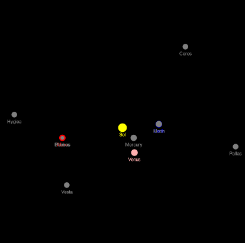
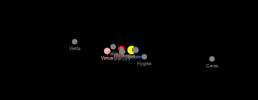

# Aufgabenblatt 7

Several files with the extension `.txt` are provided in the` states` directory. These contain
Data from each celestial body as well as its positions and velocity vectors for all
Days of the years 2019-2021. As usual, the information is in Cartesian coordinates, with the
The sun forms the origin of the coordinate system and the ecliptic represents the x-y plane.

ATTENTION: Values ​​are given in km or km / sec!

The data comes from `https: // ssd.jpl.nasa.gov / horizons.cgi # top`.

Furthermore the files `BodyCollection.java`,` StateFileNotFoundException.java`,
`StateFileFormatException.java` and` ReadDataUtil.java` supplied.

## Aim
The aim of the task is to understand and apply the concepts: copy vs. point of view
(Lecture notes p. 106), input with validation, exceptions (p. 123).

## Given interfaces
The following interface definition is given:
``
public interface BodyCollection extends BodyIterable {

    // Ensures that this collection contains the specified body. Returns 'true' if this collection
    // changed as a result of the call. (Returns false if this collection does not permit
    // duplicates and already contains the specified body.)
    boolean add (Body b);

    // Returns 'true' if this collection contains the specified body. More formally, returns
    // 'true' if and only if this collection contains at least one body 'c' such
    // that (b == null? false: b.equals (c)).
    boolean contains (Body b);

    // Returns the number of bodies in this collection.
    int size ();
    
    // Returns an array with all the bodies of this collection.
    Body [] toArray ();

}
``

## Tasks

1. Change your implementation so that a `BodyIterator` is an exception
   of type `java.util.NoSuchElementException` throws, if` next () `is called,
   however the iterator has no further iteration (`hasNext ()` returns `false`). Furthermore
   should the method `remove ()` be overwritten ([see API documentation] (https://docs.oracle.com/javase/8/docs/api/java/util/Iterator.html#remove--)),
   so that a `BodyIterator` can delete entries in its collection. Make sure that
   here in certain cases a `java.lang.IllegalStateException` should be thrown.
   (Note: that removing celestial bodies from `ComplexCosmicSystem` objects
   can lead to the fact that there can be systems with fewer than two celestial bodies
   we disregard.)

2. Add the following method to the `CosmicSystemIndex` interface
   ``
   // Returns a collection view of all `Body` objects listed in this
   // index (i.e. the set of keys). Subsequent changes in `this` will be
   // reflected in the returned collection view.
   BodyCollection getBodies ();
   ``
   and implement them in the classes `CosmicSystemMap` and` ComplexCosmicSystem`.
   Define a new class, the name of which you can choose yourself, which is a `BodyCollection`
   Provides a view of the stored key. Analogous to Listing 3.39 in the script
   Page 108, the classes should be implemented in such a way that subsequent changes in the
   Show `CosmicSystemIndex` objects also in the object returned by` getBodies () `.
   The `add` method of` BodyCollection` should be implemented in this way
   that it always returns `false`, i.e. leaves the collection unchanged.

3. Validation of input data:
    - Implement the `readConfiguration` method in the` ReadDataUtil.java` class.
      A buffered stream should be used for reading in (see script on page 128).
      For testing purposes, create variants of the txt files with format errors.
    - Add the class `Body` if necessary
      a method `setState (Vector3 position, Vector3 velocity) 'to set the position
      and the velocity vector of the celestial body.
    - Define the two specified exception classes in the appropriate
      supplied files.

4. Exception handling:
   In the class `Simulation` the celestial bodies should now be loaded with data from the given
   txt files are initialized. At least the sun and the inner planets should be
   Mercury, Venus, Earth and Mars occur. You can add other celestial bodies (see txt files)
   Add. Use the `ComplexCosmicSystem` class and its iterators to modify the
   Manage celestial bodies of the simulation.
   Change the `Simulation` class to process two command line arguments.
   The first argument is a string specifying the path to the directory where the
   corresponding txt files (e.g. `Venus.txt`,` Mercury.txt`, `Earth.txt`) with the configurations
   the heavenly bodies are to be found. The files have the names of the celestial bodies with the extension `
   .txt`. There is no txt file for the sun (the position (0,0,0) is assumed).
   The second argument is a string with a date in the form YYYY-MMM-DD, e.g.
   2020-Dec-04, which determines the day of the position and motion vector to be read out. The class
   should output appropriate error messages if problems occur during execution and the
   Stop execution in certain cases. Examples of calls in the command line interpreter with
   corresponding error messages (you can use the terminal in IntelliJ to execute them):
    ```
         $ javac Simulation.java
         $ java Simulation ../states 2021-May-28
         Running simulation ...
         $ java Simulation ../states
         Error: wrong number of arguments.
         $ java Simulation ../states 2025-Dec-12
         Error: State not available.
         $ java Simulation ../states-altered 2021-May-28
         Warning: File "Venus.txt" does not have required format. 
         Running simulation without Venus.
         Warning: File "Mars.txt" not found. 
         Running simulation without Mars.
         Running simulation ...
         $ java Simulation ../states -17
         Error: State not available.
         $ java Simulation blah -17
         Error: "blah" not found.
    ```
    
    Examples of outputs:
   
    x-y-Ebene:
   
     
    
    y-z-Ebene (freiwillig):
    
    